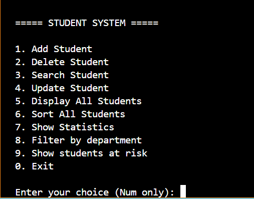
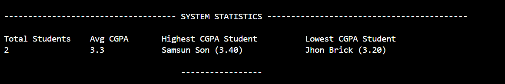
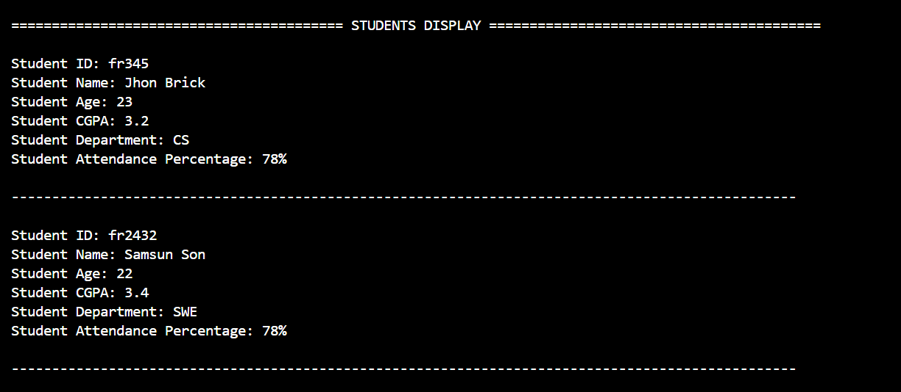

# Student Management System

A lightweight, terminal-based application built in C++ designed to manage student records efficiently. The system features persistent storage using plain text files, automatic statistics generation, and active tracking for academic risk management.

---

## 📸 Application Preview

### Main Menu
Below is the interactive command-line interface featuring all 10 core management options:


### Real-Time Statistics
The application dynamically calculates and formats class performance metrics on demand:


### Students Display
The application also prints all the students and their data on demand:


---

## 🚀 Key Features

* **Complete CRUD Operations:** Add, update, view, and delete student profiles seamlessly.
* **Smart Data Sorting & Filtering:** Organize student lists or filter records instantly by department.
* **Automated Risk Tracking:** Automatically flags any student with less than **75% attendance** as "at risk".
* **Live System Statistics:** Displays real-time academic insights including total enrollment, class average CGPA, and top/bottom academic performers.
* **Persistent Storage:** Integrated file-handling system automatically saves and loads data to and from a `.txt` file so no progress is lost.

---

## 🛠️ Tech Stack & Requirements

* **Language:** C++ (Object-Oriented Architecture)
* **Compiler:** `g++` (Supports C++11 or higher)
* **Libraries:** Standard C++ libraries only (No external dependencies required)
* **Storage:** Plain Text (`.txt`) file handling

---

## 💻 How to Build and Run

To compile and launch the application on your local machine, open your terminal and run the following commands:

### Compile and Run
```bash
# Compile the source code
g++ src/main.cpp src/Student.cpp src/StudentManager.cpp src/FileManager.cpp -o build/main

# Run the application
./build/main